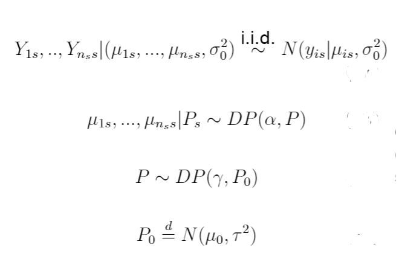
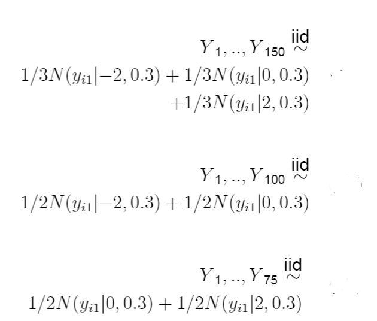

# Model implemented

# Aim
This sampler was developed for validating the backbone of the sampler implementation and investigate the effect of the Hierarchical Dirichlet Process parameters (alpha and gamma).
For an example of the latter, see Section 3.2 of the Project Report.

# Simulated data generation
Simulated data are generated according to the following:

Note that, if new data want to be tested, all can be tweaked straightforwardly by acting on the NN_DataGenerator script.

# Important note: feeding data to the sampler
Note that the Data Generator arrange the created data in a particular way, which is the one requested by the sampler: data are saved in .csv format (Data.csv), all in a single line, and another .csv file containing dimensions per season is saved aswell (Dims.csv). 

# Sampler Interface
If the aim is only using the sampler, acting on the main.cpp script provided is sufficient.
Data.csv and Dims.csv are provided simply through their paths, the data_parser provided does all the rest automatically.
A Sampler class instance is then built using those two.
Sampler parameters MUST be tweaked at this point, if needed. Here a list of the all the available setters:
* set_burnin(int n) : set the number of iterations to be burned. (We strongly suggests to decide burnin in post processing, however it is useful when trials must be repeated)
* set_n_iter(int n) : set number of total iterations
* set_mu0(double m) : mean of P0
* set_tau(double t) : variance of P0
* set_alpha(double al) : first level HDP parameter
* set_gamma(double gam) : second level HDP parameter 
* void set_sigma0(double s0) : fixed and known variance for the mixture components
* set_clust(const vector<int>& clust_): initial number of clusters per season. 
Then, initialize function must be called.
Initialize_grid permits to specify the fining of the grid on which the predictive densities will be evaluated for each season.
Sampling start the algorithm, Print shows the hidden state of the sampler.
Save estimates produces four .csv files in the working directory:
  1. clustering: in each row, reports the clustering of all observations per each iteration.
  2. mu: in each row, reports the estimates for mu of all observations per each iteration.
  3. grid: values of the grid created
  4. predictive: each row contains the corresponing season estimates for the predictive in each point of the grid
  
